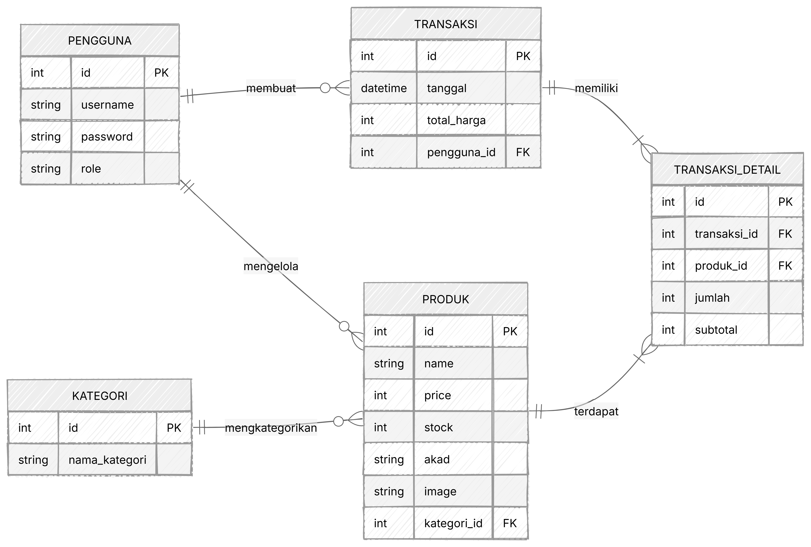
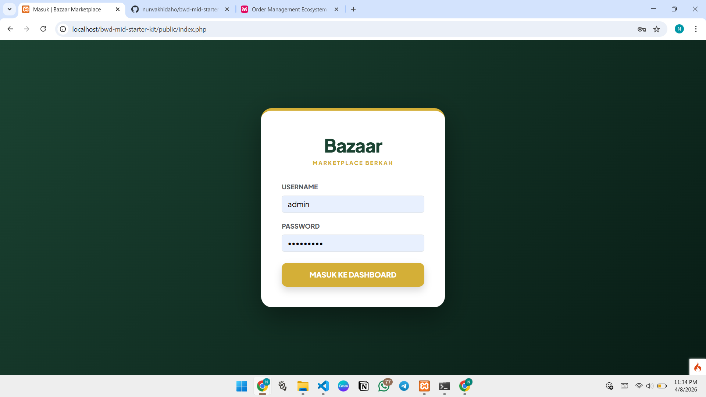
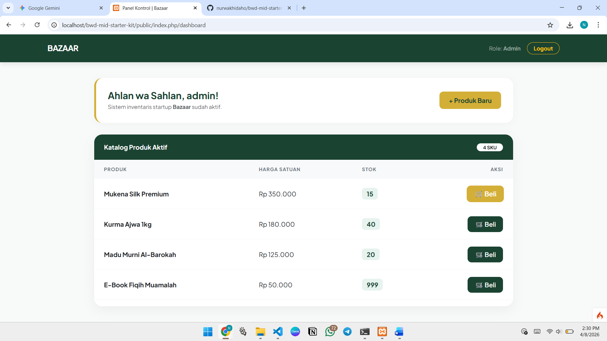
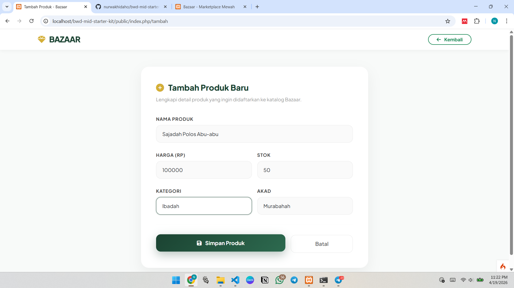
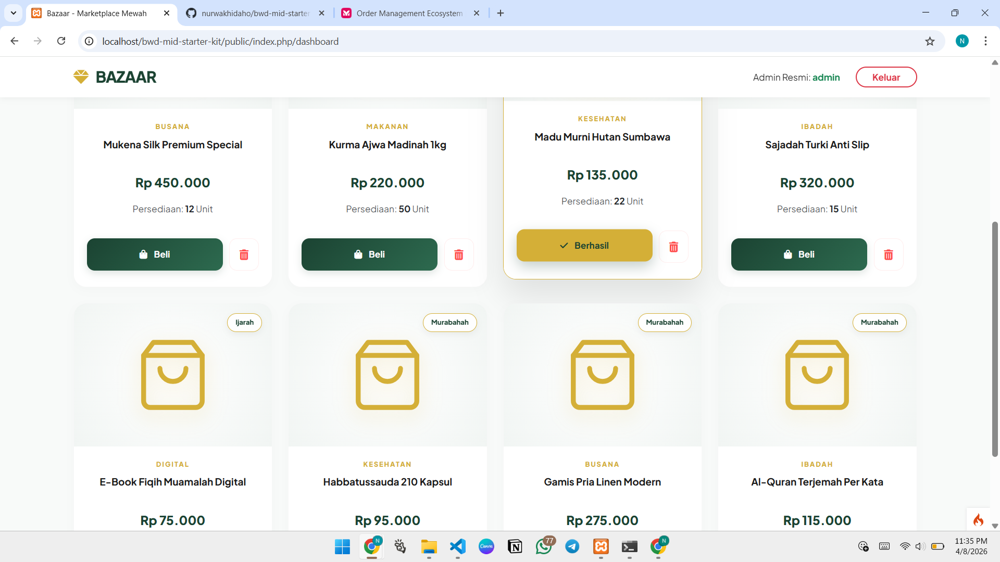
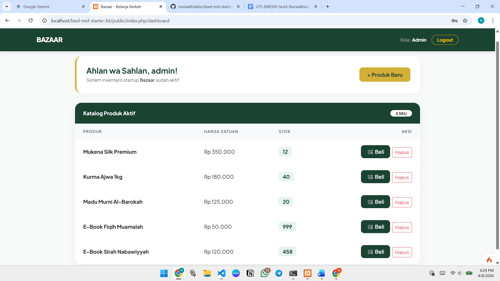
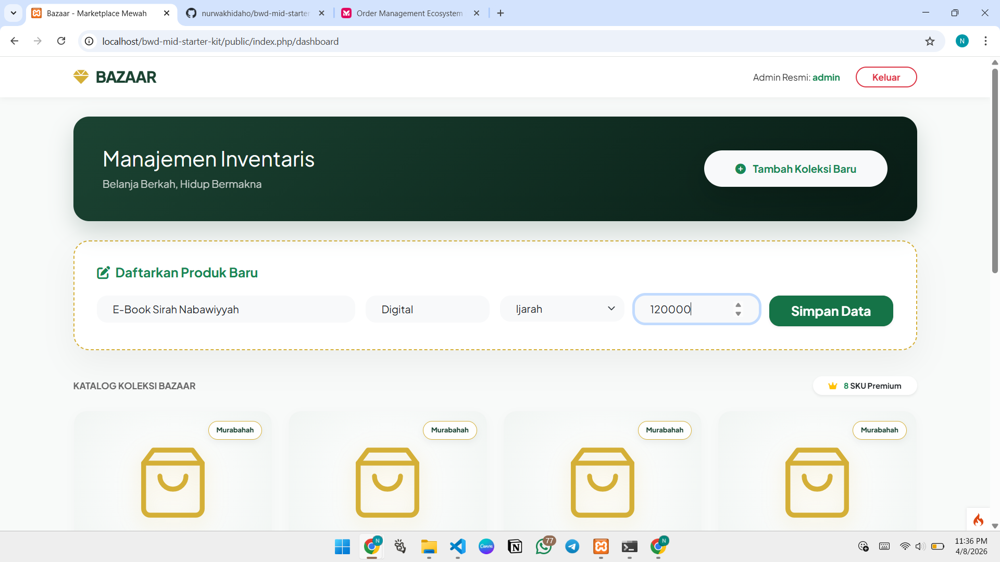
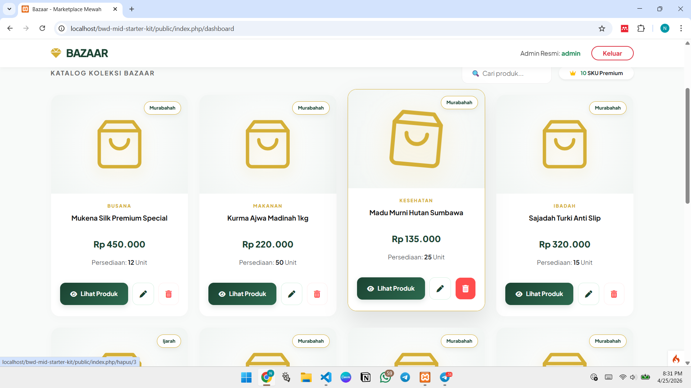
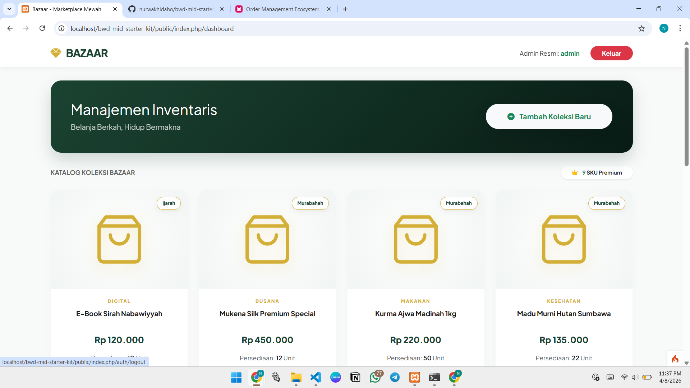
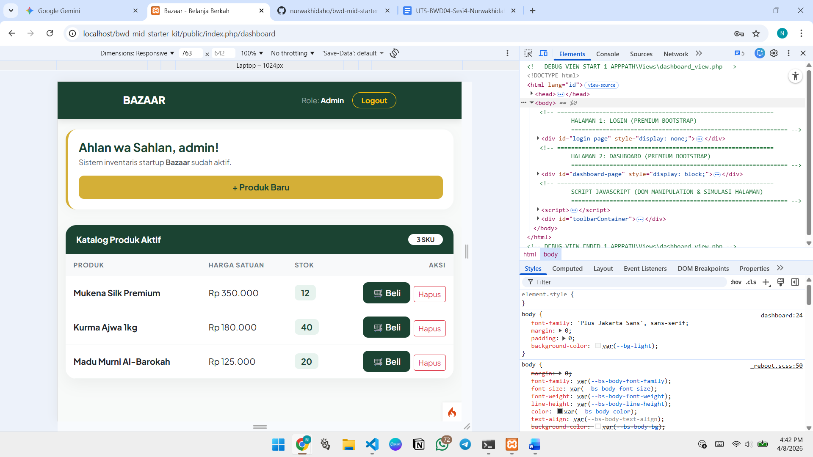

## 📝 LEMBAR JAWABAN (WAJIB DIISI)

*Nama:* Nurwakhidah Oktaviani

*NIM:* 25120100061

### 1. Profil Startup
•⁠  ⁠*Nama Startup:* Bazaar.

•⁠  ⁠*Problem yang Diselesaikan:* Pengelola toko atau bisnis produk Muslim di Indonesia sering kesulitan memantau dan mengatur katalog produk halal mereka secara efisien, mulai dari mencatat stok, memperbarui informasi produk, hingga memastikan setiap item memiliki keterangan akad yang jelas (Murabahah/Ijarah). Bazaar hadir sebagai solusi manajemen inventaris berbasis web yang memudahkan admin dalam mengelola katalog produk halal secara terpusat, transparan, dan bebas dari unsur riba.

•⁠  ⁠*Target Pengguna:* Pengelola bisnis yang membutuhkan sistem pencatatan dan pengelolaan katalog produk halal secara digital, dengan akses berbasis login yang aman.

•⁠  ⁠*Tentang Prototipe Ini:* Prototipe ini merupakan panel admin Bazaar yang berfokus pada sistem manajemen inventaris, sebagai fondasi backend sebelum tampilan sisi pembeli (customer-facing marketplace) dikembangkan.

Tabel pengguna dan produk sudah diimplementasikan pada prototipe ini. Tabel kategori, transaksi, dan transaksi_detail merupakan rancangan untuk pengembangan berikutnya seiring Bazaar berkembang menjadi marketplace penuh.

### 2. Penjelasan Fitur JavaScript (DOM)
•⁠  ⁠*Apa yang Anda buat?* Saya mengembangkan beberapa fitur interaktif berbasis manipulasi DOM pada halaman dashboard untuk mendukung proses manajemen inventaris produk halal secara langsung di antarmuka, tanpa perlu reload halaman. Berikut detail implementasinya:

* Tambah Produk Dinamis:
    Saya mengimplementasikan fungsi tambahData() yang membaca input nama, kategori, akad, harga, dan stok dari form, lalu langsung menyisipkan kartu produk baru ke dalam grid katalog menggunakan createElement dan innerHTML. Produk baru muncul dengan animasi fade-in (opacity dan transform) agar transisi terasa halus. Setelah produk ditambahkan, semua field input direset otomatis dan counter SKU diperbarui.

* Hapus Produk dengan Animasi: 
    Fungsi attachEvents() memasang event listener pada setiap tombol hapus di kartu produk. Ketika diklik dan dikonfirmasi, elemen kartu akan mengecil (scale 0.8) dan memudar (opacity 0) sebelum dihapus dari DOM, memberikan feedback visual yang jelas. Counter SKU juga ikut diperbarui secara otomatis setelah penghapusan.

* Live Search/Filter Katalog: 
    Terdapat event listener input pada field pencarian yang menyaring kartu produk secara real-time berdasarkan nama atau kategori. Produk yang tidak cocok akan disembunyikan (display: none), dan hitungan SKU yang tampil ikut menyesuaikan jumlah produk yang terlihat.

* Modal Detail Produk: 
    Setiap tombol "Lihat Produk" menyimpan data produk (nama, kategori, akad, harga, stok) sebagai data-* attribute. Saat modal Bootstrap terbuka, JavaScript membaca atribut-atribut tersebut dan mengisi elemen di dalam modal secara dinamis tanpa request ke server.

*Tujuan:* Memastikan pengelola Bazaar bisa memantau dan mengoperasikan katalog produk halal mereka, mulai dari melihat detail, menambah, hingga menghapus produk, secara responsif dan cepat tanpa hambatan loading ulang halaman.

### 3. Entity Relationship Diagram (ERD)
*ERD Bazaar*

*Halaman Login*

*Halaman Dashboard*

*Halaman Form Tambah Produk*

*Halaman Dashboard - Edit Produk*

*Halaman Dashboard - Delete Produk*

*Halaman Dashboard - Cari Produk*

*Halaman Database PhpMyAdmin*

### 4. Refleksi Refactoring
•⁠  ⁠*Pertanyaan:* Kenapa kita harus memisahkan kode menjadi Model, View, dan Controller (MVC)? Kenapa tidak pakai cara lama seperti di ⁠ spaghetti.php ⁠ saja?

•⁠  ⁠*Jawaban:* Kalau dilihat dari struktur proyek Bazaar ini, manfaat MVC jadi sangat konkret. Di spaghetti.php versi lama, query database, logika bisnis, dan tampilan HTML tercampur jadi satu file. Itu mungkin masih oke ketika aplikasinya kecil, tapi begitu fitur bertambah seperti sistem login, CRUD produk halal, manajemen akad, edit, dan hapus, kodenya langsung jadi susah dibaca dan rawan error.

Dengan MVC yang diterapkan di Bazaar, tanggung jawab masing-masing bagian jadi jelas. ProductModel.php hanya mengurus koneksi dan operasi ke tabel produk, Dashboard.php sebagai Controller yang mengatur alur logika seperti validasi sesi dan pemanggilan model, dan dashboard_view.php hanya fokus menampilkan data yang sudah disiapkan Controller. Kalau misalnya ada bug di query produk, kita tahu langsung ke mana harus lihat, tidak perlu scroll ratusan baris file campuran.

Selain itu, pola MVC juga membuat fitur baru lebih mudah ditambahkan. Ketika ada kebutuhan fitur edit produk, cukup tambah method edit() dan update() di Controller, buat view baru edit_produk.php, dan tidak ada yang perlu disentuh di Model karena ProductModel sudah siap dipakai ulang. Ini yang tidak bisa dilakukan dengan rapi kalau semua kode menumpuk di satu file, apalagi kalau ke depannya Bazaar akan scale-up dengan fitur customer-facing marketplace yang jauh lebih kompleks.
