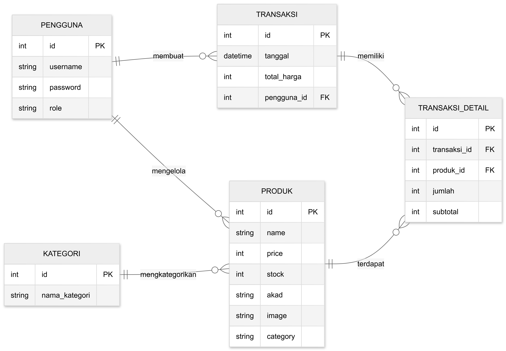
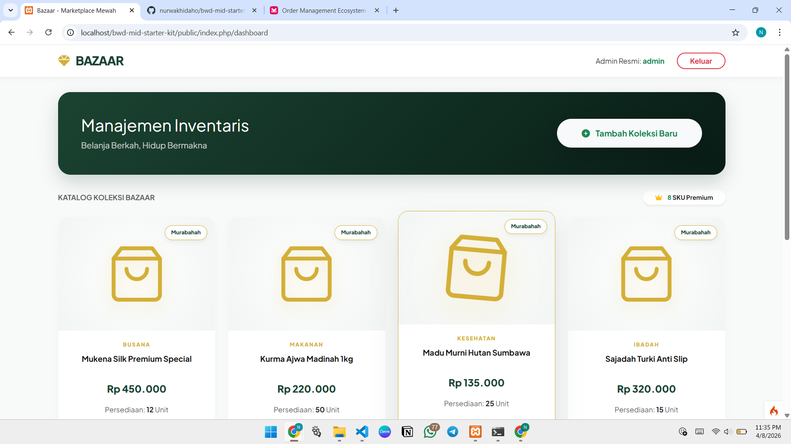
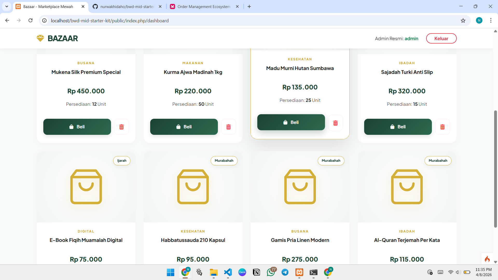
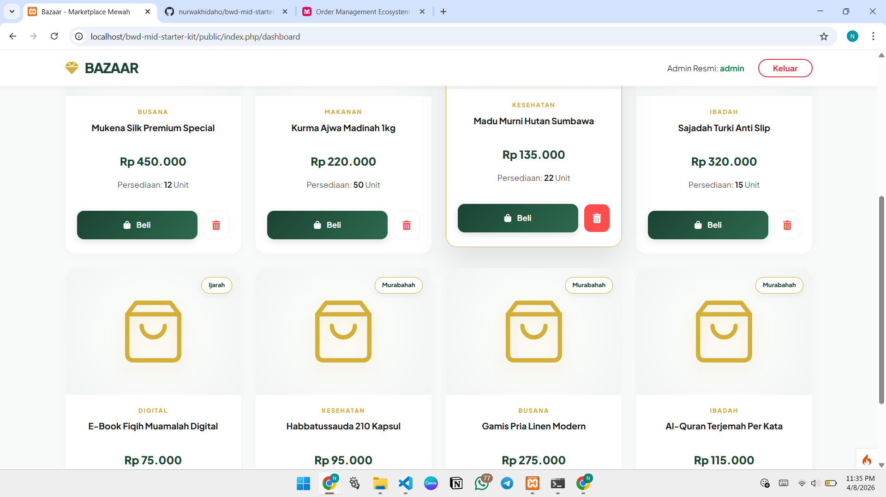

# 🚀 UTS: Pengembangan Aplikasi Web (Refactoring ke MVC)

## ⚠️ PERHATIAN PENTING SEBELUM MENGERJAKAN!
Tujuan utama ujian ini adalah *memperbaiki kode yang berantakan* (Legacy Code) menjadi rapi di dalam framework CodeIgniter 4. 

*ATURAN MAIN:*

1.⁠ ⁠Anda *DILARANG* hanya menyalin data dari file lama

2.⁠ ⁠Anda *WAJIB* menyesuaikan data barang/jasa di dalam Model sesuai dengan *Ide Startup* Anda masing-masing (yang anda tentukan sendiri).

3.⁠ ⁠Jika Startup Anda adalah "Kedai Kopi", maka data yang tampil harus Menu Kopi, bukan "Laptop Pro".

---

## 🛠️ LANGKAH-LANGKAH PENGERJAAN

### Langkah 1: Pahami Masalah (Legacy Code)
Buka folder ⁠`legacy_code/spaghetti.php`⁠. Lihat betapa berantakannya kode tersebut (Spaghetti Code). 

Tugas Anda adalah memindahkan fungsi-fungsinya ke tempat yang benar di folder `app/`. (DONE)

### Langkah 2: Kelola Data (Model)
•⁠  ⁠Buka `app/Models/ProductModel.php`.

•⁠  ⁠*TUGAS:* Ganti isi array di dalam fungsi `getDummyData()` dengan data yang sesuai dengan bisnis Startup Anda (Minimal 3 data).

•⁠  ⁠Contoh: Jika startup Anda jasa cuci sepatu, maka datanya adalah: `Cuci Deep Clean`⁠, `Un-yellowing`, dll. (DONE)

### Langkah 3: Logika Login & Logout (Controller Auth)
•⁠  ⁠Buka `app/Controllers/Auth.php`.

•⁠  ⁠Cari tanda `// TODO: TUGAS MAHASISWA!`.

•⁠  ⁠Selesaikan logika proses login dan logout menggunakan Session CodeIgniter 4.

### Langkah 4: Proteksi Halaman (Controller Dashboard)
•⁠  ⁠Buka `app/Controllers/Dashboard.php`.

•⁠  ⁠Cari tanda `// TODO: TUGAS MAHASISWA!`.

•⁠  ⁠Tambahkan kode untuk mengecek apakah user sudah login atau belum. Jika belum login, user tidak boleh bisa melihat dashboard!

### Langkah 5: Interaktivitas (View & JavaScript)
•⁠  ⁠Buka `app/Views/dashboard_view.php`.

•⁠  ⁠Di bagian paling bawah, ada tag `<script>`.

•⁠  ⁠*TUGAS:* Buatlah fitur JavaScript sederhana (DOM Manipulation). Contoh: Ketika tombol "Beli" diklik, jumlah stok di baris tersebut berkurang secara otomatis di layar.

---

## 📝 LEMBAR JAWABAN (WAJIB DIISI)

*Nama:* Nurwakhidah Oktaviani

*NIM:* 25120100061

### 1. Profil Startup
•⁠  ⁠*Nama Startup:* Bazaar.

•⁠  ⁠*Problem yang Diselesaikan:* Memberikan rasa aman dan keberkahan bagi konsumen Muslim melalui marketplace yang 100% terverifikasi halal dan sistem transaksi yang bebas dari unsur riba (bunga).

•⁠  ⁠*Target Pengguna:* Masyarakat Muslim Indonesia usia 18-45 tahun yang melek digital dan mencari produk serta layanan (seperti umrah) yang sesuai syari'at.

### 2. Penjelasan Fitur JavaScript (DOM)
•⁠  ⁠*Apa yang Anda buat?* Saya fokus mengembangkan fitur yang interaktif pada halaman dashboard agar manajemen barang jadi lebih efisien dan responsif. Beberapa hal yang saya implementasikan adalah:

* Fitur Transaksi Real-Time:
    Saya membuat fitur manipulasi DOM pada halaman dashboard. Ketika pengguna mengklik tombol "Beli", fungsi javascript akan menangkap ID produk tersebut dan secara otomatis mengurangi angka stok di tabel secara real-time tanpa perlu refresh halaman. Hal ini memastikan proses belanja di Bazaar terasa lancar bagi pengguna.

* Input Produk Dinamis: 
    Saya juga menambahkan fitur untuk menambah inventaris baru secara instan. Melalui form yang disediakan, Admin dapat memasukkan produk baru ke dalam tabel katalog tanpa jeda waktu, sehingga update barang bisa dilakukan dengan lebih fleksibel sesuai kebutuhan pasar.

* Manajemen Katalog: 
    Terdapat fitur hapus baris yang memudahkan pengelola untuk merapikan daftar inventaris. Jika ada produk yang sudah tidak relevan atau habis, Admin bisa langsung menghilangkannya dari tampilan antarmuka secara praktis.

*Tujuan:* Memastikan dashboard Bazaar memiliki performa yang cepat dan pengalaman pengguna yang modern, di mana setiap perubahan data bisa langsung terlihat tanpa hambatan loading halaman.

### 3. Entity Relationship Diagram (ERD)
*ERD Bazaar*

*Halaman Login*

*Halaman Dashboard Awal*

*Halaman Dashboard - Form Tambah Produk*

*Halaman Dashboard - Berhasil Tambah Produk*

*Halaman Database PhpMyAdmin*

### 4. Refleksi Refactoring
•⁠  ⁠*Pertanyaan:* Kenapa kita harus memisahkan kode menjadi Model, View, dan Controller (MVC)? Kenapa tidak pakai cara lama seperti di ⁠ spaghetti.php ⁠ saja?

•⁠  ⁠*Jawaban:* Menurut saya memisahkan kode dengan pola MVC ini agar tugas-tugas lebih terorganisir dan tidak terjadi tumpang tindih. Kalau tetap pakai cara lama (spaghetti code), semua kodenya akan menumpuk di satu tempat dan itu sangat membingungkan saat aplikasi mulai besar atau bisnis mulai scale up. Bisa diibaratkan seperti kita mencari satu barang di gudang yang berantakan. Dengan memakai pola MVC, maka setiap bagian punya tanggungjawab masing-masing. Pimisahan ini juga membuat code lebih rapi, mudah diperbaiki jika ada error dan pastinya lebih siap untuk dikembangkan lebih besar.

---
Kumpulkan tugas dengan cara mengirimkan file zip berisi BWD-MID-STARTER-KIT yang sudah dimodifikasi

[def]: erd_bazaar.png